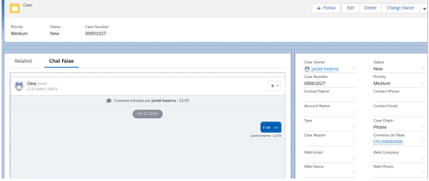

#################
Layouts de exemplo do Falae
#################

Alguns objetos apresentam layouts de exemplo disponíveis após a instalação do pacote, sendo estes layouts de exemplos formas de mostrar a utilização de recursos destes objetos, sendo eles Caso, Contato e Lead.
Recomendamos o uso da Pagina de Registro para o uso do **LIGHTNING.**

Caso -> Case Layout - Sample Falae
-----------------------

.. figure:: img/sampleLayout1.png
    :width: 500px
    :alt: Solidity logo
    :align: center

    Layouts da páginas.

No objeto Caso, temos o exemplo de Layout mostrando como implementar o **Chat do Falae** caso tenha alguma conversa vinculada com o objeto.

.. figure:: img/sampleLayout2.png
    :width: 800px
    :alt: Solidity logo
    :align: center

    Exemplo de utilização da Página do Visualforce - **FLChatCase**.

    

Contato -> Contact Layout - Sample Falae
-----------------------

.. figure:: img/sampleLayout3.png
    :width: 500px
    :alt: Solidity logo
    :align: center

    Layouts da páginas.

No objeto Contato, temos o exemplo de Layout mostrando como implementar o **Inbox do Falae** caso tenha alguma conversa vinculada com o objeto.

.. figure:: img/sampleLayout4.png
    :width: 800px
    :alt: Solidity logo
    :align: center

    Exemplo de utilização da Página do Visualforce - **FLInboxContact**.

Lead -> Lead Layout - Sample Falae
-----------------------

.. figure:: img/sampleLayout5.png
    :width: 500px
    :alt: Solidity logo
    :align: center

    Layouts da páginas.

No objeto Lead, temos o exemplo de Layout mostrando como implementar o **Inbox do Falae** caso tenha alguma conversa vinculada com o objeto.

.. figure:: img/sampleLayout6.png
    :width: 800px
    :alt: Solidity logo
    :align: center

    Exemplo de utilização da Página do Visualforce - **FLInboxLead**.

Caso-> Páginas de Registro -> Componentes ->Falae
-----------------------
Dentro das páginas de registro Lightning temos os nossos componentes ,eles podem ser usados como componentes padrão do SalesForce ou seja  pode customizar o layout com os componentes tanto do SalesForce quanto do produto Falae. Recomendamos o uso do Layout de Página para o uso do **CLASSIC**.

.. figure:: img/Lightningfalae.png
    :width: 800px
    :alt: Solidity logo
    :align: center

    Componentes do **FALAE** 

Páginas de Registro ->Implementar Chat do Falae
-----------------------

No objeto Caso, temos o exemplo mostrando como implementar o 
Chat do Falae.
Escolha o componente do Falae no campo busca (Fig 01)  e 
arraste o componente **Chat Falae** (Fig 02)

    Escolha o componente do Falae no **busca**  (Fig 01)

     Arraste o componente **Chat Falae**

Páginas de Registro -> Utilizando  componentes 
-----------------------

Na figura  abaixo  temos  duas guias personalizadas,componentes **“Chat do Fale** e **FlinboxUser”**

    Componentes  **Chat do Fale**

    No objeto Caso, temos o exemplo dos componentes  **“Chat do Fale  e FlinboxUser”**

Contato -> Páginas de Registro -> Inbox do Falae
-----------------------

No objeto Contato, temos o exemplo de como implementar o **Inbox do Falae** caso tenha alguma conversa já  vinculada .

    **Inbox do Falae**

Lead -> Páginas de Registro -> Inbox do Falae
-----------------------

No objeto Lead, temos o exemplo do  **Inbox do Falae** .

    **Inbox do Falae**

